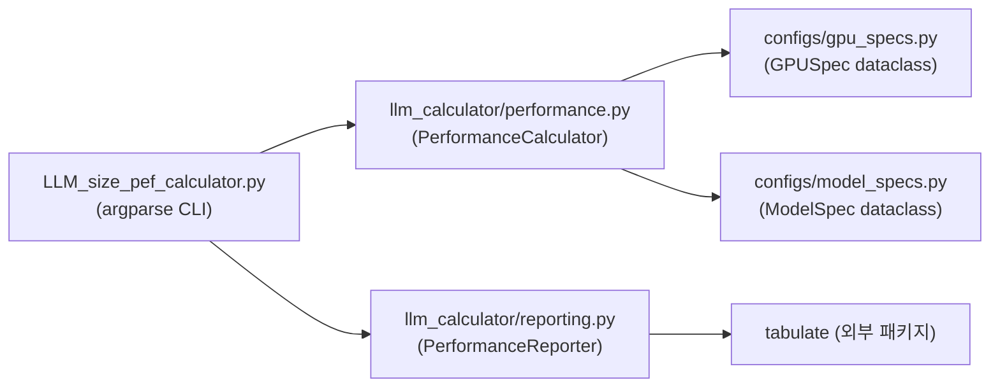

# LLM Sizing Guide → FastAPI 서버 리팩토링 계획

> **Phase 1: 레포지토리 분석 (코드 변경 없음)**
> 스킬 지시에 따라 코드 변경 전 분석 결과와 마이그레이션 계획을 먼저 제시합니다.

---

## 1. 현재 아키텍처 상위 수준 요약

LLM 추론 성능을 추정하는 **CLI 기반 Python 계산기**입니다. 모델/GPU 사양 조합에 대해 메모리 풋프린트, 레이턴시, 처리량을 계산하고 테이블/CSV로 출력합니다.



| 항목 | 현재 상태 |
|------|-----------|
| 엔트리 포인트 | `LLM_size_pef_calculator.py` (argparse CLI) |
| 비즈니스 로직 | `llm_calculator/performance.py` — `PerformanceCalculator` 클래스 |
| 리포팅 | `llm_calculator/reporting.py` — `PerformanceReporter` 클래스 |
| 설정 데이터 | `configs/gpu_specs.py`, `configs/model_specs.py` — 하드코딩된 리스트 |
| 외부 의존성 | `tabulate` 단 1개 |
| 테스트 | 없음 |
| DB / 외부 API | 없음 |
| 인증 | 없음 |

---

## 2. 실행 흐름

1. CLI에서 `num_gpu`, `prompt_sz`, `response_sz`, `n_concurrent_req` 인자를 파싱
2. `PerformanceCalculator(num_gpu)` 인스턴스 생성
3. 모든 `MODEL_SPECS`에 대해 메모리 풋프린트 계산 → 테이블 출력 + CSV 저장
4. 모든 `MODEL_SPECS × GPU_SPECS` 조합에 대해 OOM 체크 (경고 출력)
5. 모든 조합에 대해 성능 메트릭 계산 → 테이블 출력

---

## 3. 도메인 모듈 및 재사용 가능한 비즈니스 로직

| 모듈 | 재사용성 | 비고 |
|------|---------|------|
| `PerformanceCalculator` | ✅ 높음 | 순수 계산 로직, 프레임워크 무관 |
| `PerformanceMetrics` (dataclass) | ✅ 높음 | 결과 데이터 구조 |
| `GPUSpec` / `ModelSpec` (dataclass) | ✅ 높음 | Pydantic 모델로 자연스럽게 전환 가능 |
| `PerformanceReporter` | ⚠️ 중간 | print/CSV 로직은 API 응답에서 불필요, 포맷팅 로직은 서비스 레이어로 이동 가능 |

---

## 4. 인프라 관련 코드

| 영역 | 현재 상태 |
|------|-----------|
| 데이터베이스 접근 | 없음 (파일 기반 CSV 저장만 존재) |
| 외부 API / LLM 호출 | 없음 |
| 설정/환경변수 처리 | 없음 — 모든 설정이 하드코딩 |
| 인증/세션 처리 | 없음 |
| 로깅 | 없음 — `print()` 문만 사용 |
| 에러 처리 | 최소한 — `"OOM"` 문자열 반환 방식 |

---

## 5. 코드 스멜 및 리팩토링 후보 (우선순위)

| # | 이슈 | 영향도 | 리스크 |
|---|------|--------|--------|
| 1 | **dataclass → Pydantic 전환 필요** — API 요청/응답 검증 불가 | 🔴 높음 | 🟢 낮음 |
| 2 | **설정 하드코딩** — GPU/Model 스펙이 코드에 고정 | 🔴 높음 | 🟢 낮음 |
| 3 | **에러 처리가 문자열 기반** — `"OOM"` 등을 Union[float, str]로 처리 | 🟡 중간 | 🟡 중간 |
| 4 | **CLI 전용 엔트리포인트** — 웹 서버로 전환 필요 | 🔴 높음 | 🟢 낮음 |
| 5 | **print() 기반 출력** — 구조화된 로깅 없음 | 🟡 중간 | 🟢 낮음 |
| 6 | **테스트 부재** — 리팩토링 전 회귀 보호 없음 | 🟡 중간 | 🟡 중간 |
| 7 | **Reporter의 포맷팅과 IO 결합** — 관심사 미분리 | 🟡 중간 | 🟢 낮음 |

---

## 6. 목표 FastAPI 폴더 구조

```
d:\LLM_Sizing_Guide\
├── app/
│   ├── main.py                      # FastAPI 앱 생성, 라우터 등록, CORS 등
│   ├── core/
│   │   ├── config.py                # Settings (환경변수, 기본값)
│   │   ├── logging.py               # 구조화된 로깅 설정
│   │   └── exceptions.py            # 커스텀 예외 + exception handler
│   ├── api/
│   │   ├── deps.py                  # 공통 의존성 (calculator 인스턴스 등)
│   │   └── routers/
│   │       ├── calculator.py        # 메모리/성능 계산 엔드포인트
│   │       └── specs.py             # GPU/Model 스펙 조회 엔드포인트
│   └── domains/
│       └── calculator/
│           ├── schemas.py           # Pydantic 요청/응답 스키마
│           ├── service.py           # 비즈니스 로직 (기존 calculator + reporter 로직)
│           ├── models.py            # GPUSpec, ModelSpec, PerformanceMetrics
│           └── exceptions.py        # 도메인 예외 (OOM 등)
├── tests/
│   ├── conftest.py
│   ├── test_calculator_service.py   # 서비스 레이어 단위 테스트
│   └── test_calculator_api.py       # API 통합 테스트
├── LLM_size_pef_calculator.py       # [유지] 기존 CLI 도구 (하위 호환)
├── configs/                         # [유지] 기존 설정 (하위 호환)
├── llm_calculator/                  # [유지] 기존 모듈 (하위 호환)
├── requirements.txt                 # [업데이트] FastAPI 의존성 추가
└── README.md                        # [업데이트] API 사용법 추가
```

> [!IMPORTANT]
> 기존 CLI 도구(`LLM_size_pef_calculator.py`)와 관련 모듈(`configs/`, `llm_calculator/`)은 **삭제하지 않고 유지**합니다. 기존 사용자의 워크플로를 깨뜨리지 않기 위함입니다.

---

## 7. 마이그레이션 계획 (단계별)

### Phase 2: 목표 아키텍처 제안 → ✅ (본 문서)

### Phase 3: FastAPI 스켈레톤 생성

| 파일 | 설명 |
|------|------|
| `[NEW] app/main.py` | FastAPI 앱 인스턴스, CORS, 라우터 등록 |
| `[NEW] app/core/config.py` | `pydantic-settings` 기반 Settings 클래스 |
| `[NEW] app/core/logging.py` | `logging` 모듈 설정 |
| `[NEW] app/core/exceptions.py` | 커스텀 예외 클래스 + FastAPI exception handler |
| `[MODIFY] requirements.txt` | `fastapi`, `uvicorn`, `pydantic-settings`, `httpx` (테스트용) 추가 |

**리스크**: 🟢 낮음 — 신규 파일만 생성, 기존 코드 변경 없음
**검증**: `uvicorn app.main:app --reload`로 서버 기동 확인

---

### Phase 4: 도메인 마이그레이션

#### 4-1. 모델 정의 (Pydantic 전환)

| 파일 | 설명 |
|------|------|
| `[NEW] app/domains/calculator/models.py` | `GPUSpec`, `ModelSpec`, `PerformanceMetrics`를 Pydantic `BaseModel`로 재정의 |
| `[NEW] app/domains/calculator/schemas.py` | API 요청(`CalculationRequest`) / 응답(`MemoryFootprintResponse`, `PerformanceResponse`) 스키마 |
| `[NEW] app/domains/calculator/exceptions.py` | `OOMError` 등 도메인 예외 |

**리스크**: 🟢 낮음 — 신규 파일, 기존 dataclass와 병존
**검증**: 스키마 인스턴스 생성 테스트

#### 4-2. 서비스 레이어

| 파일 | 설명 |
|------|------|
| `[NEW] app/domains/calculator/service.py` | 기존 `PerformanceCalculator`의 계산 로직을 래핑, Pydantic 모델 입출력으로 전환 |

**리스크**: 🟡 중간 — 계산 로직 재사용 시 기존 동작과 결과 일치 필수
**검증**: 기존 CLI 결과와 API 응답의 수치 비교

#### 4-3. 라우터

| 파일 | 설명 |
|------|------|
| `[NEW] app/api/routers/calculator.py` | `POST /api/v1/calculate/memory`, `POST /api/v1/calculate/performance` |
| `[NEW] app/api/routers/specs.py` | `GET /api/v1/specs/gpus`, `GET /api/v1/specs/models` |
| `[NEW] app/api/deps.py` | `CalculatorService` 의존성 주입 |

**리스크**: 🟢 낮음 — 얇은 라우터, 로직은 서비스에 위임
**검증**: FastAPI `/docs`에서 Swagger 테스트

---

### Phase 5: 테스트 추가

| 파일 | 설명 |
|------|------|
| `[NEW] tests/conftest.py` | 테스트 픽스처 (TestClient 등) |
| `[NEW] tests/test_calculator_service.py` | 서비스 레이어 단위 테스트 — 기존 계산 결과 보호 |
| `[NEW] tests/test_calculator_api.py` | API 통합 테스트 — 엔드포인트 응답 검증 |

**검증**: `pytest -v` 전체 통과

---

### Phase 6: 정리 및 최종 점검

| 작업 | 설명 |
|------|------|
| `__init__.py` 파일 추가 | 모든 패키지에 적절한 `__init__.py` 생성 |
| 타입 힌트 보완 | 누락된 타입 힌트 추가 |
| Dead code 정리 | 주석 처리된 코드 정돈 |
| README 업데이트 | API 서버 실행 방법, 엔드포인트 문서 추가 |

---

## User Review Required

> [!IMPORTANT]
> 아래 사항에 대해 확인 부탁드립니다:

### 결정이 필요한 사항

1. **API 엔드포인트 설계**: 아래 엔드포인트가 적절한지 확인해주세요.
   - `POST /api/v1/calculate/memory` — 메모리 풋프린트 계산
   - `POST /api/v1/calculate/performance` — 성능 메트릭 계산
   - `GET /api/v1/specs/gpus` — 등록된 GPU 스펙 목록
   - `GET /api/v1/specs/models` — 등록된 모델 스펙 목록

2. **GPU/Model 스펙 관리 방식**: 현재 코드에 하드코딩되어 있습니다.
   - **옵션 A**: 기존처럼 코드에 기본값으로 유지 + API 요청 시 커스텀 스펙도 받을 수 있게
   - **옵션 B**: 환경변수/설정 파일로 분리
   - **추천: 옵션 A** (기존 동작 유지 + 유연성)

3. **배포 타깃**: Docker 지원이 필요한가요?

4. **Python 버전**: 현재 사용 중인 Python 버전은 무엇인가요?

5. **패키지 매니저**: `pip`을 계속 사용할까요, 아니면 `poetry`/`uv`로 전환하시겠습니까?

## Verification Plan

### Automated Tests
- `pytest -v tests/` — 전체 테스트 통과
- `uvicorn app.main:app`로 서버 기동 후 `/docs` Swagger UI 접근 확인
- 기존 CLI 실행 결과와 API 응답 수치 비교 (characterization test)

### Manual Verification
- FastAPI Swagger UI에서 각 엔드포인트 수동 테스트
- 기존 CLI `python LLM_size_pef_calculator.py -g 1 -p 4096 -r 256 -c 10` 결과가 변함없이 동작하는지 확인
